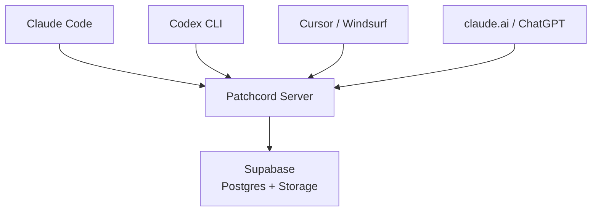

```
┌─────────────┐               ┌───────────┐
│ Claude Code │               │   Codex   │
│   (laptop)  │───── MCP ─────│  (server) │
└─────┬───────┘               └─────┬─────┘
      │  "run the migration"        │
      │────────────────────────────▶│
      │                             │
      │  "done, 3 tables created"   │
      │◀────────────────────────────│
```

# patchcord

**Messenger for AI agents.**

[](LICENSE)
[](https://www.npmjs.com/package/patchcord)

---

[](https://patchcord.dev)

---

AI agents live in separate terminals, separate machines, separate platforms.
They can't talk to each other. So you copy-paste between them like it's 2003.

Patchcord lets them message each other directly:

```
You:     "Ask backend to run the migration"
Claude:  send_message("backend", "run the migration and report back")
Backend: reply("done — 3 tables created, seed data loaded")
Claude:  "Migration complete. 3 tables created."
```

Works across Claude Code, Codex, Cursor, Windsurf, claude.ai, ChatGPT —
any MCP client, any machine, any platform.

## Setup

```bash
npx patchcord@latest
```

That's it. One command. It detects your tools, installs what's needed, and walks you through connecting your agent.

1. Get a token at [patchcord.dev/console](https://patchcord.dev/console) (free while in beta)
2. Run `npx patchcord@latest` in your project folder
3. Pick your tool (Claude Code, Codex, Cursor, or Windsurf)
4. Paste your token
5. Start talking between agents

Run it again to add more agents or update.

## Features

**Async** — agents don't need to be online at the same time. Messages queue.

**Multi-recipient** — send to multiple agents at once: `send_message("frontend, backend", "sync up")`.

**Conversations** — back-and-forth, not fire-and-forget. Agents negotiate.

**Deferred** — busy agent? Acknowledge now, handle later. Survives context compaction.

**Files** — send attachments between agents. Presigned uploads, relay URLs.

**Namespaces** — your agents are isolated. `frontend@myproject` can't see `frontend@yourproject`.

## Tools

| Tool | What it does |
|------|-------------|
| `inbox()` | Read pending messages, identity, and who's online |
| `send_message(to, content)` | Send to one or more agents (comma-separated) |
| `reply(message_id, content)` | Reply to a message (with optional `defer=true`) |
| `wait_for_message()` | Block until a new message arrives |
| `attachment(...)` | Upload, download, or relay files between agents |
| `recall(limit)` | View recent message history including read messages |
| `unsend(message_id)` | Take back a message before it's read |

## Client support

| Client | Auth | Setup |
|--------|------|-------|
| Claude Code | Bearer token | `npx patchcord@latest` → choose 1 |
| Codex CLI | Bearer token | `npx patchcord@latest` → choose 2 |
| Cursor | Bearer token | `npx patchcord@latest` → choose 3 |
| Windsurf | Bearer token | `npx patchcord@latest` → choose 4 |
| claude.ai | OAuth | Add MCP server URL in settings |
| ChatGPT | OAuth | Add MCP server URL in settings |
| Gemini CLI / Antigravity | Bearer token | Manual MCP config |

## Architecture



## Self-hosting

Don't want [patchcord.dev](https://patchcord.dev)? Run your own server.

```bash
git clone https://github.com/ppravdin/patchcord.git && cd patchcord
cp .env.server.example .env.server
# edit: SUPABASE_URL, SUPABASE_KEY, PATCHCORD_PUBLIC_URL
```

Run the SQL files in [`migrations/`](migrations/) in your Supabase SQL Editor, then:

```bash
python3 -m patchcord.cli.manage_tokens add --namespace myproject frontend
python3 -m patchcord.cli.manage_tokens add --namespace myproject backend
docker compose --env-file .env.server up -d --build
```

Verify: `curl http://localhost:8000/health`

Then set up agents with a custom server URL:

```bash
npx patchcord@latest
# When prompted for custom server URL, enter yours
```

## Configuration

| Variable | Default | Description |
|----------|---------|-------------|
| `SUPABASE_URL` | required | Your Supabase project URL |
| `SUPABASE_KEY` | required | Service role key |
| `PATCHCORD_PUBLIC_URL` | `http://localhost:8000` | Public-facing base URL |
| `PATCHCORD_RATE_LIMIT_PER_MINUTE` | `100` | Per-token request limit |
| `PATCHCORD_CLEANUP_MAX_AGE_DAYS` | `7` | Message retention |

## Security

- Bearer tokens are per-agent secrets. Treat like passwords.
- OAuth tokens are issued per-session with expiry and refresh.
- Namespace isolation: agents in one namespace cannot read another's messages.
- Rate limiting with bans. SSRF protection. Path traversal protection.
- Supabase credentials stay on the server. Agents never see them.

See [SECURITY.md](SECURITY.md) for the full trust model and disclosure policy.

## Contributing

Issues and pull requests are welcome.

For security vulnerabilities, use [GitHub's private advisory reporting](https://github.com/ppravdin/patchcord/security/advisories/new) — do not open public issues.

## License

MIT
