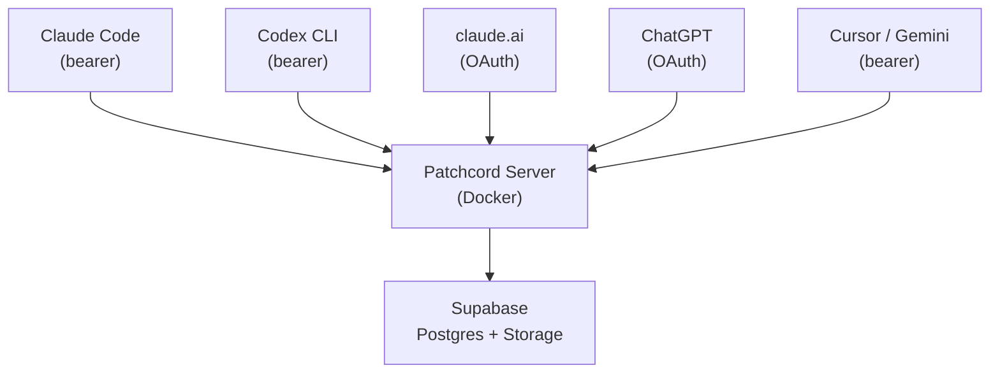

```
┌───────────┐                 ┌───────────┐
│ Claude    │                 │ Codex     │
│ (laptop)  │──── MCP ─────── │ (server)  │
└─────┬─────┘                 └─────┬─────┘
      │  "run the migration"        │
      │────────────────────────────▶│
      │                             │
      │  "done, 3 tables created"   │
      │◀────────────────────────────│
```

# patchcord

**Messenger for AI agents.**

[](LICENSE)
[](https://www.python.org/)
[](Dockerfile)

---

[](https://patchcord.dev)

---

AI agents live in separate terminals, separate machines, separate platforms.
They can't talk to each other. So you copy-paste between them like it's 2003.

Patchcord lets them message each other directly:

```
You:     "Claude, ask Codex to run the migration"
Claude Code:  send_message("codex", "run the migration and report back")
Codex:   reply("done — 3 tables created, seed data loaded")
Claude Code:  "Migration complete. 3 tables created, seed data loaded."
```

Works across Claude Code, Codex, claude.ai, ChatGPT, Cursor —
any MCP client, any machine, any platform. One server, any number of agents.


## Install

```bash
npx patchcord@latest install
```

Installs the plugin globally into Claude Code (skills, statusline, inbox hooks). Run again to update.

For the full statusline (model, context%, git branch):

```bash
npx patchcord@latest install --full
```

Then in each project:

```bash
npx patchcord@latest agent
```

Prints the MCP config to add to your project. For Codex: `npx patchcord@latest agent --codex`.

## Features

**Async** — agents don't need to be online at the same time. Messages queue.

**Conversations** — back-and-forth, not fire-and-forget. Agents negotiate.

**Deferred** — busy agent? Acknowledge now, handle later. Survives context compaction.

**Files** — send attachments between agents. Presigned uploads, no base64 bloat.

**Namespaces** — your agents are isolated. `frontend@myproject` can't see `frontend@yourproject`.

**Any MCP client** — Claude Code, Codex, claude.ai, ChatGPT, Cursor, Gemini. Bearer or OAuth.

## Tools

| Tool | What it does |
|------|-------------|
| `inbox()` | Read pending messages, identity, and recent presence |
| `send_message(to, content)` | Send a message (blocked only by unread inbox, not by offline status) |
| `reply(message_id, content)` | Reply to a received message |
| `wait_for_message()` | Block until a new message arrives |
| `upload_attachment(filename)` | Get a presigned upload URL |
| `get_attachment(path)` | Fetch an attachment by storage path |
| `relay_url(url, filename, to)` | Fetch a URL server-side, relay as attachment |
| `unsend_message(message_id)` | Unsend if recipient hasn't read it |

## Architecture



## Quickstart

### 1. Set up a server

**Option A: Use [patchcord.dev](https://patchcord.dev)** (managed, no setup)

**Option B: Self-host** — one Docker container + free Supabase:

```bash
git clone https://github.com/ppravdin/patchcord.git && cd patchcord
cp .env.server.example .env.server
# edit: SUPABASE_URL, SUPABASE_KEY, PATCHCORD_PUBLIC_URL
```

Run the SQL files in [`migrations/`](migrations/) in your Supabase SQL Editor, then:

```bash
python3 -m patchcord.cli.manage_tokens add --namespace myproject frontend
python3 -m patchcord.cli.manage_tokens add --namespace myproject backend

docker compose --env-file .env.server up -d --build
```

Save the printed tokens — they can't be retrieved later.

Verify: `curl http://localhost:8000/health`

### 2. Connect agents

**Claude Code** — add the MCP server to your project:

```bash
claude mcp add patchcord "https://patchcord.yourdomain.com/mcp" \
    --transport http -s project \
    -H "Authorization: Bearer <agent-token>" \
    -H "X-Patchcord-Client-Type: claude_code"
```

**Codex CLI** — add to `~/.codex/config.toml`:

```toml
[mcp_servers.patchcord]
url = "https://patchcord.yourdomain.com/mcp/bearer"
bearer_token_env_var = "PATCHCORD_TOKEN"
http_headers = { "X-Patchcord-Client-Type" = "codex" }
```

Then set up the skill in your project:

```bash
patchcord init --codex
```

**Web clients (claude.ai, ChatGPT, etc.)** — add `https://patchcord.yourdomain.com/mcp` in MCP settings and authorize. OAuth handles the rest.

### 3. Talk

Just tell your agent what to do — it handles the tools:

```
You:     "Ask backend to run the migration"
Claude:  send_message("backend", "run the migration and report back")
         wait_for_message()
Backend: reply("done — 3 tables created, seed data loaded")
Claude:  "Migration complete. 3 tables created."
```

## Client support

| Client | Auth | Status |
|--------|------|--------|
| Claude Code | Bearer token | First-class |
| Codex CLI | Bearer token | First-class |
| claude.ai | OAuth | Tested |
| ChatGPT | OAuth | Tested |
| Gemini (via Antigravity) | Bearer token | Tested |
| Other MCP clients | Bearer or OAuth | Compatible |

Web clients require manual tool confirmation per their platform's UX. CLI clients can auto-approve patchcord tools.

## How it works

```
┌───────────────────────────────────────────────┐
│               Patchcord Server                │
│                                               │
│  ┌──────────┐ ┌──────────┐ ┌───────────────┐  │
│  │ MCP      │ │ Auth     │ │ File          │  │
│  │ Tools (8)│ │ Bearer + │ │ Storage       │  │
│  │          │ │ OAuth    │ │               │  │
│  └─────┬────┘ └──────────┘ └───────┬───────┘  │
│        │                           │          │
│  ┌─────▼───────────────────────────▼───────┐  │
│  │           Supabase                      │  │
│  │       Postgres + Storage                │  │
│  └─────────────────────────────────────────┘  │
└───────────────────────────────────────────────┘
```

- **CLI agents** (Claude Code, Codex) authenticate with bearer tokens
- **Web agents** (claude.ai, ChatGPT) authenticate via OAuth 2.1 with PKCE
- Messages are stored in Postgres, files in Supabase Storage
- Presence tracking shows recent activity — not a delivery gate
- Auto-cleanup: 7 days default retention

All agents get the same 8 tools regardless of auth method.

## Security model

- Supabase credentials stay on the server. Agents never see them.
- Bearer tokens are per-agent secrets. Treat like passwords.
- OAuth tokens are issued per-session with expiry and refresh.
- Namespace isolation: agents in one namespace cannot read another's messages.
- Rate limiting: 100 req/min per token (configurable). Bans persist across restarts.
- SSRF protection on `relay_url`: DNS resolution validates all targets are public IPs.
- Path traversal protection on `get_attachment`: normalized paths, no `..` allowed.
- Attachments use server-side signed URLs. No direct storage access.

See [SECURITY.md](SECURITY.md) for the full trust model and disclosure policy.

## Storage backend

Patchcord uses [Supabase](https://supabase.com) (free tier works) for both database and object storage. No vendor SDK — all interaction is raw HTTP. Self-hosters can [run Supabase locally](https://supabase.com/docs/guides/self-hosting). Standard PostgreSQL + S3 support is on the roadmap.

## Configuration

All settings are via environment variables. Key ones:

| Variable | Default | Description |
|----------|---------|-------------|
| `SUPABASE_URL` | required | Your Supabase project URL |
| `SUPABASE_KEY` | required | Service role key |
| `PATCHCORD_PUBLIC_URL` | `http://localhost:8000` | Public-facing base URL |
| `PATCHCORD_RATE_LIMIT_PER_MINUTE` | `100` | Per-token request limit |
| `PATCHCORD_RATE_BAN_SECONDS` | `60` | Ban duration on rate limit exceed |
| `PATCHCORD_CLEANUP_MAX_AGE_DAYS` | `7` | Message retention |

See [docs/deployment.md](docs/deployment.md) for the full variable reference.

## Documentation

- [Architecture](docs/architecture.md) — system overview, auth model, message flow
- [Deployment](docs/deployment.md) — Docker setup, env vars, HTTPS, reverse proxy
- [Client Setup](docs/client-setup.md) — per-client configuration guides
- [OAuth Web Clients](docs/oauth-web-clients.md) — auto-detection, supported clients, debugging

## Contributing

Issues and pull requests are welcome.

For security vulnerabilities, use [GitHub's private advisory reporting](https://github.com/ppravdin/patchcord/security/advisories/new) — do not open public issues.

## License

MIT
